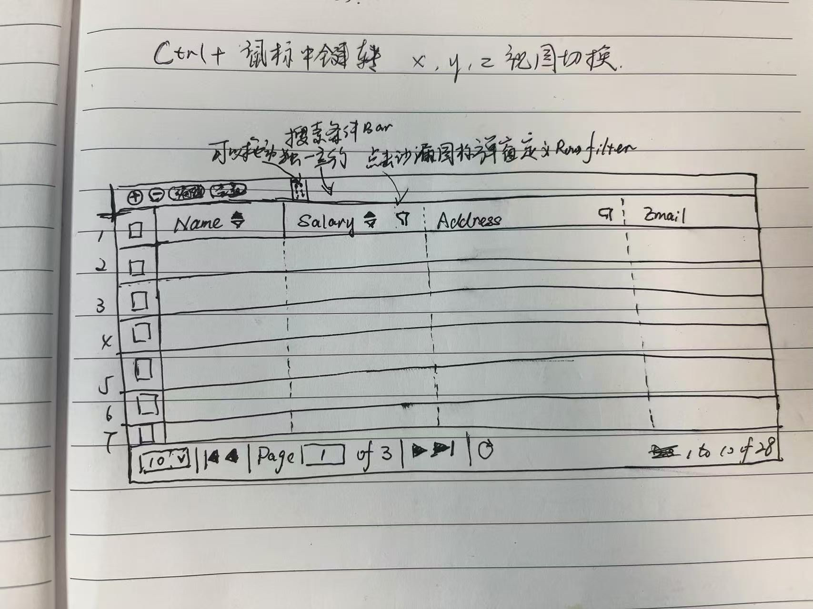

# Datagrid 将被设计成高度可配置的完成CRUD的组件

它的核心功能是：

* 主体是二维表
  * 通过开关设置，可选中行，可单选、多选。
  * 顶部 toolbar 可以自定义，添加自定义按钮。
  * 顶部过滤条件，可以自定义过滤字段。
  * 左侧可以显示行数，也可以通过开关关闭。
  * 底部 toolbar 可以自定义，添加自定义按钮。
  * Filter Row 功能，将每列自动形成一个过滤器行，里边的控件是通过字段类型自动映射的。只需要一个开关即可启用。
  * 翻页器
    * 每页的行数
    * 第一页
    * 上一页
    * 输入具体的页数
    * 呈现总共的页数
    * 下一页
    * 最后一页
    * 刷新按钮
    * loading 状态呈现
    * Displaying 11 to 20 of 28 items
    * 翻页器toolbar自定义按钮
    * 自定义翻页器的位置(top, bottom)
  * 排序功能
    * 可以自定义哪些列可以排序。
    * 支持多列排序。
  * Column Group 功能
  * Aligning Columns 功能，可以自定义表头和表体的对齐方式。
  * Frozen Columns 功能，可以通过配置冻结某些列。
  * 格式化特定列的内容。可以通过自定义js函数来实现特定的格式化。
  * Frozen Rows，可以通过配置冻结某些行。
  * Group Rows in DataGrid，对表内容进行分组。
  * Row Editing，对行进行编辑，每个列根据字段类型渲染对应表单控件，操作过程记录修改的行，修改后统一提交，这里需要后端实现批量修改的接口。
  * Cell Editing in DataGrid, 对单元格进行编辑, 点击某个单元格后激活该单元格的编辑模式。
  * DataGrid Row Style, 满足特定条件的行，设置特定的样式。
  * DataGrid Cell Style， 满足特定条件的单元格，设置特定的样式。
  * Footer Rows in DataGrid, 在脚尾显示统计信息。
  * Merge Cells for DataGrid, 可以对某些单元格进行合并。
  * Context Menu on DataGrid, 可以对DataGrid进行右键菜单。
  * Expand row in DataGrid to show details, 可以对某一行进行展开，显示更多的信息。
  * Expand row in DataGrid to show subgrid, 可以对某一行进行展开，显示子表。
  * Loading nested subgrid data, 点击展开按钮，加载子表数据，支持多级子表。
  * Display large amount of data in DataGrid without pagination, 可以显示大量数据，不需要分页。
  * DataGrid Card View, 可以将DataGrid显示成卡片视图。
  * DataGrid Buffer View, 可以将DataGrid显示成缓冲区视图，向下滚动时，会加载更多数据。
  * DataGrid Virtual Scrolling, 可以将DataGrid显示成虚拟滚动视图，向下滚动时，会加载更多数据。
  * DataGrid Virtual Scroll View with Detail Rows, 可以将DataGrid显示成虚拟滚动视图，向下滚动时，会加载更多数据，同时可以展开行，显示更多的信息。
  * Fluid DataGrid, 可以给每列设置百分比宽度。
  * 可以拖拽列的宽度并记录下来，下次打开时，使用到记录的宽度。
  * 可以调整列的顺序，并且记录下来，下次打开时，恢复到记录的顺序。

搜索过滤弹窗操作逻辑

(部门 = 人力资源部 AND 年龄 >= 35) OR 入职时间 在 2020-01-01 和 2024-01-01 之间

* 部门、年龄、入职时间 为字段名
* 「人力资源部」、「35」、「2020-01-01」、「2024-01-01」是字段值
* 「=」、「>=」是比较表达式
* 「AND」、「OR」是逻辑表达式

当鼠标悬停在「部门 = 人力资源部」、「AND」、「年龄 >= 35」、
「OR」、「入职时间 在 2020-01-01 和 2024-01-01 之间」时，会出现添加、删除按钮。

* 点击添加按钮可以输入字段名
* 选择字段名后，会触发比较表达式（如果有）的编辑和选择，比如「=」
* 选择逻辑表达式后会进入字段值的选择或者输入
* 点击删除按钮可以删除对应的整个字段表达式
