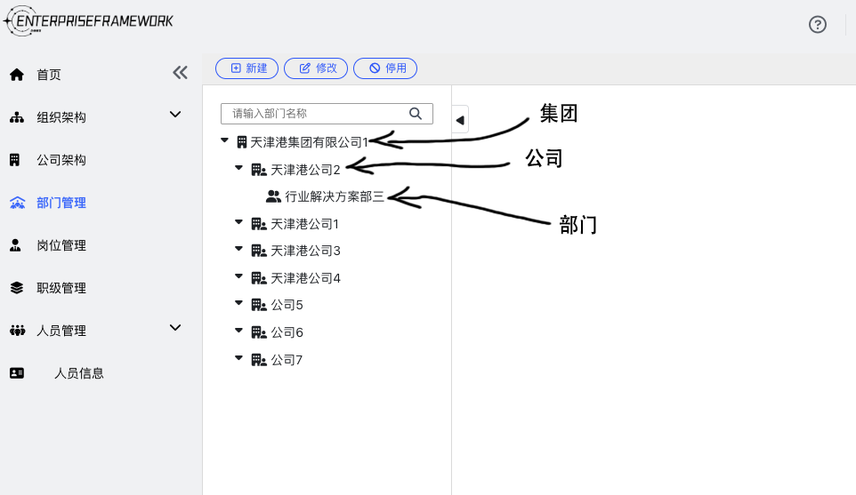
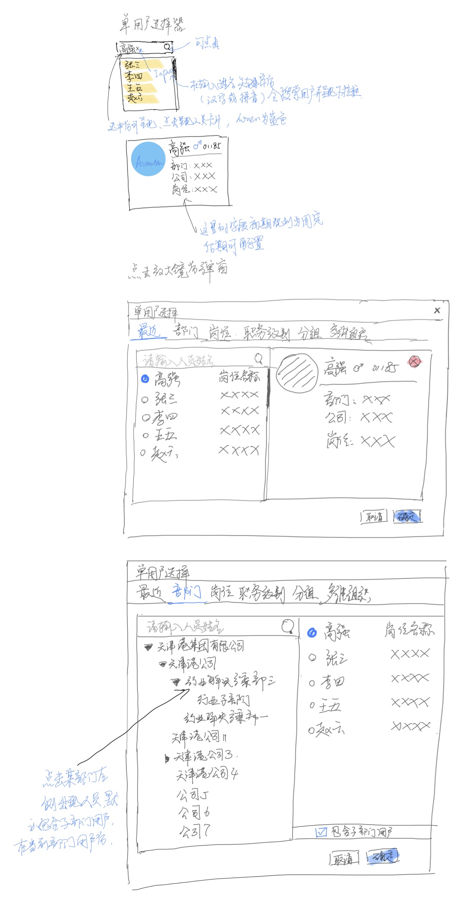

# 组织架构

## 公司架构

## 部门管理

点击选中公司、部门后，并点击「新建」按钮，右侧「所属公司」「上级部门」自动带出的逻辑

|          | 所属公司           | 上级部门   |
| ---------| ------------------| ---------|
| 选中的公司 | 选中的公司         | 无        |
| 选中的部门 | 选中的部门的所属公司 | 选中的部门 |

## 用户选择器

