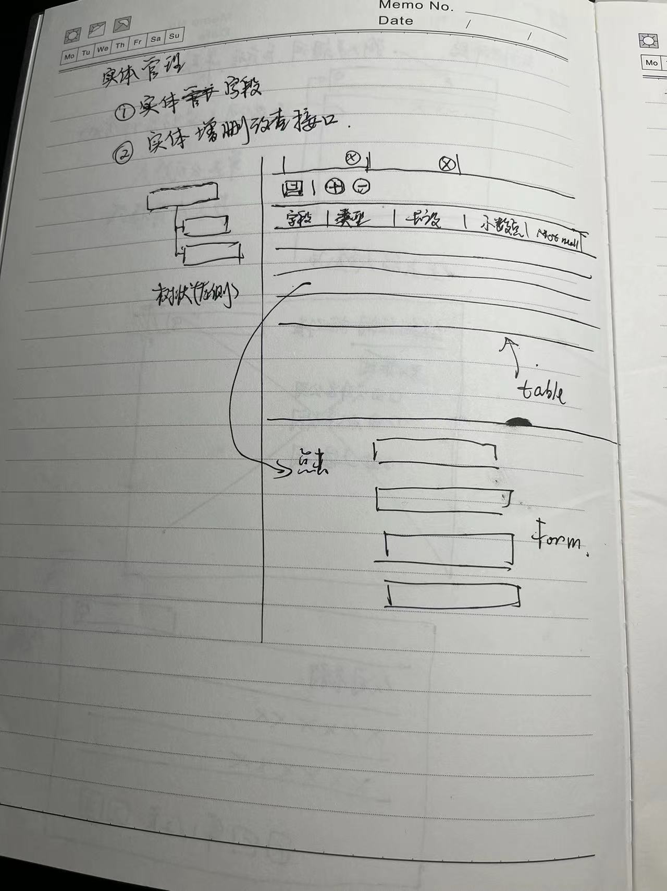

# 实体及属性介绍

## 不同实体会有不同的属性分类

实体和属性之间，按照树状建立一种分类的关系，以此为基础构建更为立体、复杂的用户界面层次。
数据虽然存储在扁平化的数据库表中，但在用户层面的呈现是以标签页，甚至标签页里的分类页签来
呈现给最终用户的。这种分类更偏向布局目的，所以应该更灵活可配，例如先后顺序，呈现样式等。

## 不同的Entity类型的属性，应该有相应的FormType

* Company --> CompanyType 公司选择控件
* Department --> DepartmentType 部门选择控件
* User --> UserType 人员选择控件

## 实体管理

