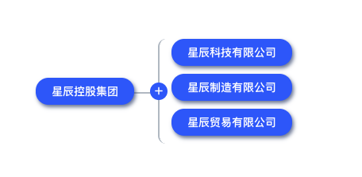

## 组织架构

组织架构是企业管理的重要组成部分，是企业组织形式的一种外化表现，同时也是人员组织形式的一种具体配置过程，我们按照通常的组织架构形式，将组织架构管理的模型分为公司架构、部门管理、岗位管理、职级管理、人员管理等。由于目前的版本暂未考虑超大型组织，所以暂未考虑多集团、树状公司架构的情况（但实际上公司的数据库模型已经做好树状准备）。

其中人员管理因为其未来可能的复杂性和特殊性，单独作为一个功能模块进行规划，这也是钉钉等系统曾经做过的那样，最终人员管理会因为其专业化、复杂性而独立成为满足人力部门入转调离、人员花名册、薪资社保公积金、多维组织管理等需求衍生出来大量功能。

### 公司架构

公司架构，在事业单位等同于单位架构，默认页面我们通过简单的图形化方式表达公司列表，用户可以通过点击加号添加公司，通过鼠标放到集团或公司名称上后出现的编辑按钮可以对集团或公司进行编辑。

### 部门管理

部门管理，通过左侧的树状结构可以直接给某公司或部门创建下级部门，也可以对已存在部门进行编辑和停用。

### 岗位管理

### 职级管理

## 人员管理

### 人员信息
