## UI

### Button 按钮

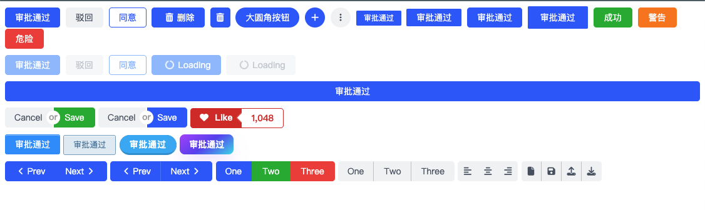

### Divider 分隔线

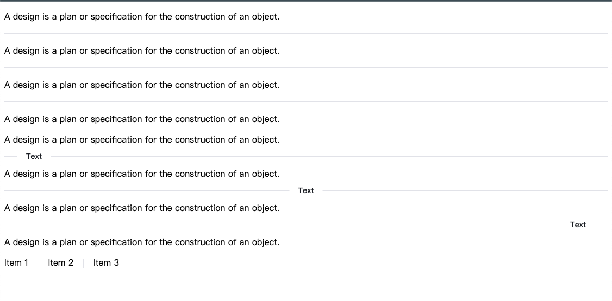

### Grid 网格布局

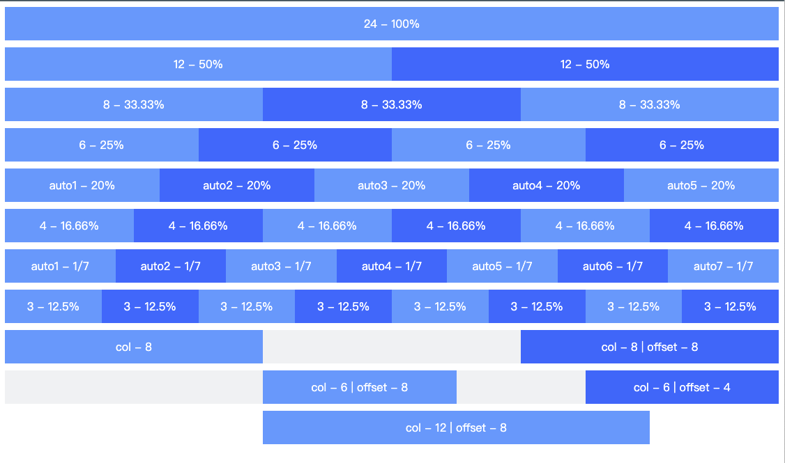

### Layout 布局

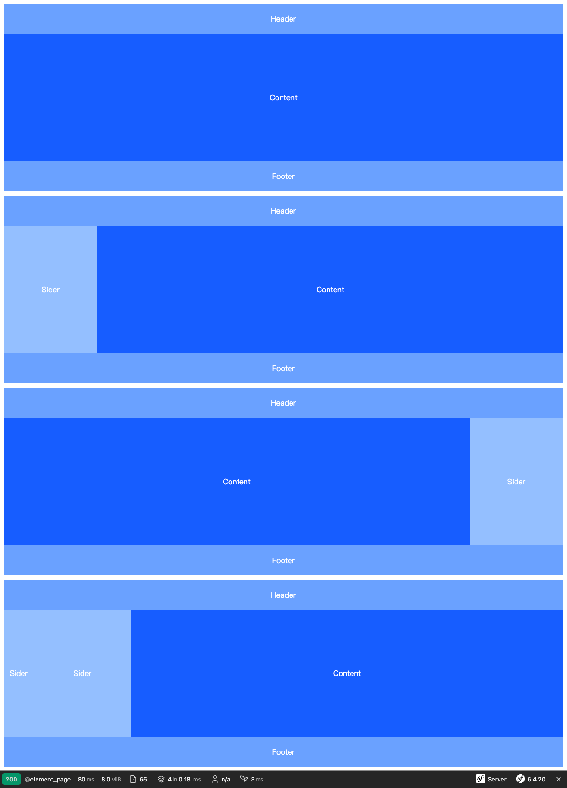

### Link 链接

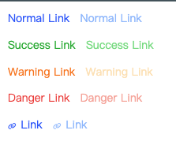

### Input 单行文本输入框

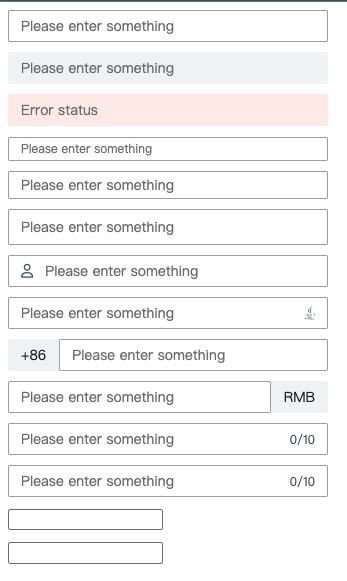

### InputNumber 数字输入框

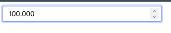

### Switch 切换按钮

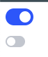

### Select 选择框

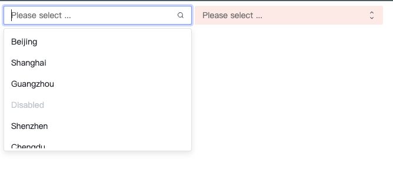

### Textarea 多行文本

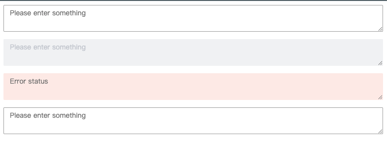

### Modal 模态窗口

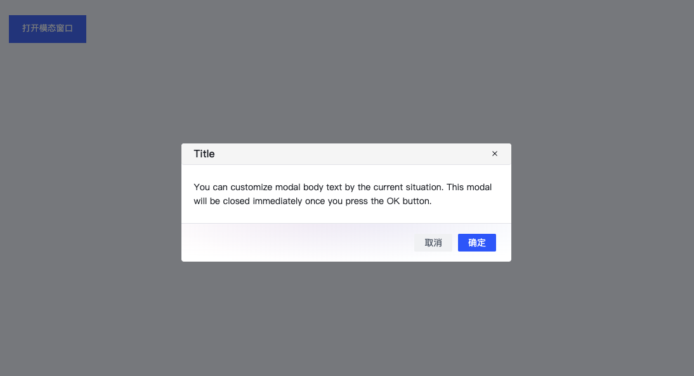

### Radio 单选框

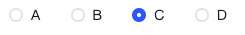

### Checkbox 复选框

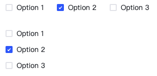

### Tabs 标签页

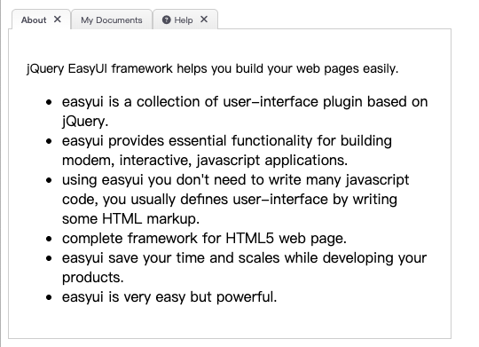

### Table 表格

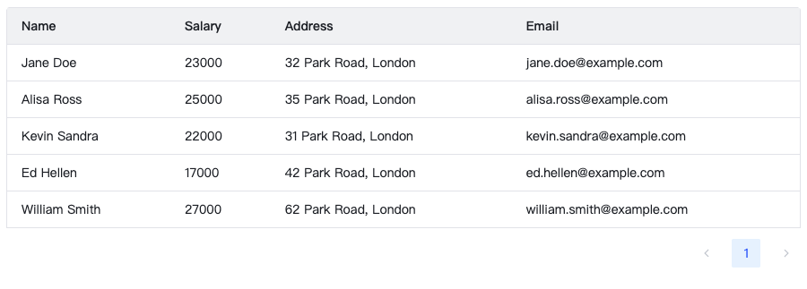

### 单部门选择器

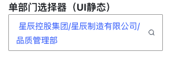

### Drawer 抽屉

### Alert 提示

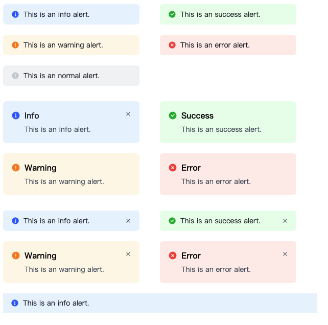

### Model Managment 模型管理

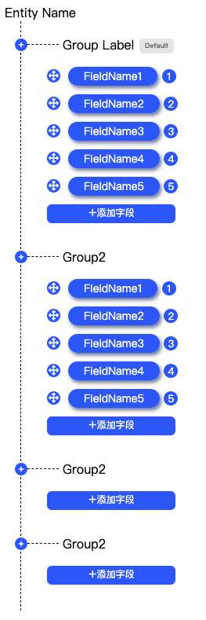

### User 人员选择器

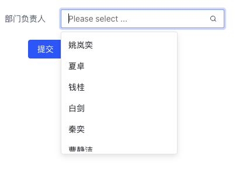

### Datagrid 数据表格

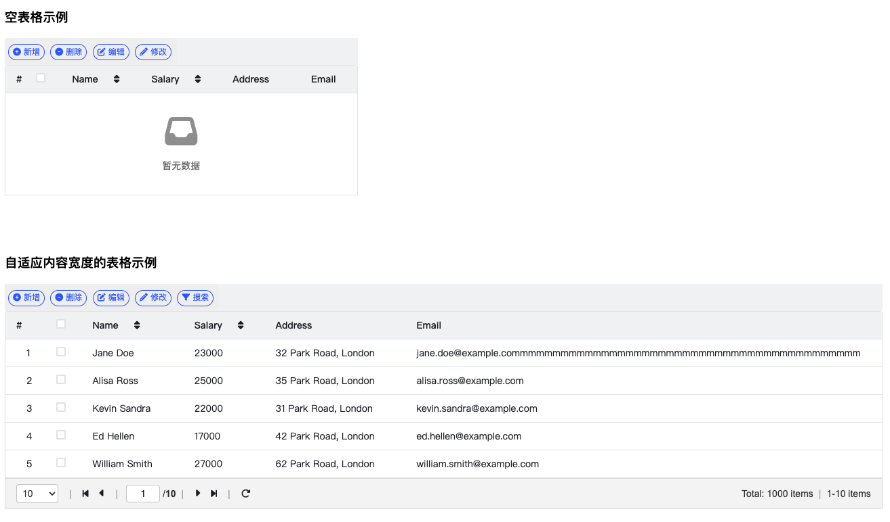
