# 框架 UI 组件库 (Framework UI Components)

本文档旨在为 AI 和开发者提供本框架内置 UI 组件的使用说明。本框架采用自定义样式的 UI 组件，优先通过 Twig Macro 或标准 HTML 结构引入，避免使用原生的或者第三方的直接实现。

所有的 Twig Macro 均定义在 `templates/ui/template/ui.html.twig` 中，可以通过以下方式在 Twig 模板中引入：

```twig

```

---

## 1. 基础组件 (Basic Components)

### 1.1 按钮 (Button)

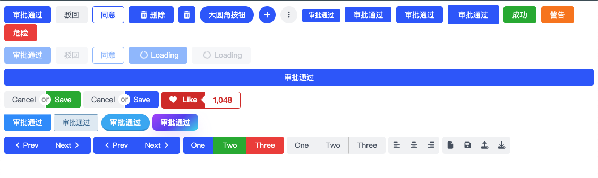
框架提供了基础按钮的样式类。

**依赖资源:**

- CSS: `/public/sunui/components/button.css`

**HTML 示例:**

```html
<!-- 主按钮 -->
<button class="btn primary medium" type="button">Primary Button</button>
<!-- 镂空按钮 -->
<button class="btn outline medium" type="button">Outline Button</button>
<!-- 危险按钮 -->
<button class="btn danger medium" type="button">Danger Button</button>
```

**工具栏按钮 (Twig Macro):**

```twig
{{ ui.barButton('create', '新增', 'btn outline primary medium mini round icon', 'fa-solid fa-plus-circle', 'add-btn') }}
```

### 1.2 单行文本输入框 (Input)

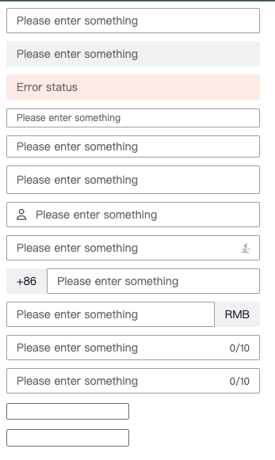
为了保持统一的边框、聚焦（Focus）效果以及高度，建议使用 `ui.input` 宏或者 `ef-input-wrapper` 包裹。

**依赖资源:**

- CSS: `/public/sunui/components/input.css`
- JS: `/public/sunui/components/input.js`

**Twig Macro:**

```twig
{# ui.input(id, type, placeholder, value, wrapperClass, inputClass, attributes) #}
{{ ui.input('myInput', 'text', '请输入内容', '', 'ef-input-rounded') }}
```

**HTML 示例:**

```html
<span class="ef-input-wrapper">
    <input type="text" class="ef-input ef-input-size-medium text" placeholder="请输入内容" />
</span>
```

> **注意**: 不要使用 `.custom-input` 或原生 `<input>`，必须包裹在 `ef-input-wrapper` 内。

### 1.3 数字输入框 (InputNumber)

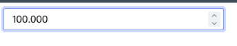
数字输入框带有加减按钮步进功能。

**依赖资源:**

- CSS: `/public/sunui/components/input-number.css`
- JS: `/public/sunui/components/input-number.js`

**Twig Macro:**

```twig
{# ui.inputNumber(id, max, min, step, precision, placeholder, wrapperClass) #}
{{ ui.inputNumber('myNumber', 100, 0, 1, 0, '请输入数字') }}
```

### 1.4 多行文本 (Textarea)

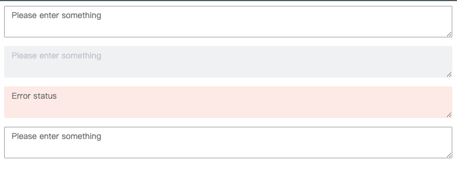
支持自动调整高度或限制行数的多行文本框。

**依赖资源:**

- CSS: `/public/sunui/components/textarea.css`
- JS: `/public/sunui/components/textarea.js`

**Twig Macro:**

```twig
{# ui.textarea(id, placeholder, minRows, maxRows, wrapperClass) #}
{{ ui.textarea('myTextarea', '请输入描述', 3, 10) }}
```

**HTML 示例:**

```html
<div class="ef-textarea-wrapper">
    <textarea class="ef-textarea resizeable" min-rows="3" max-rows="10" placeholder="请输入"></textarea>
</div>
```

### 1.5 链接 (Link)

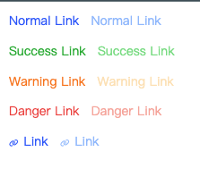
标准的文字链接。

**依赖资源:**

- CSS: `/public/sunui/components/link.css`

**Twig Macro:**

```twig
{# ui.link(text, href, type, classes, attributes) #}
{{ ui.link('主色链接', '#', 'primary') }}
{{ ui.link('危险链接', '#', 'danger') }}
```

**HTML 示例:**

```html
<a class="ef-link ef-link-primary" href="#">主色链接</a>
<a class="ef-link ef-link-danger" href="#">危险链接</a>
<a class="ef-link ef-link-disabled" href="#">禁用链接</a>
```

### 1.6 分隔线 (Divider)

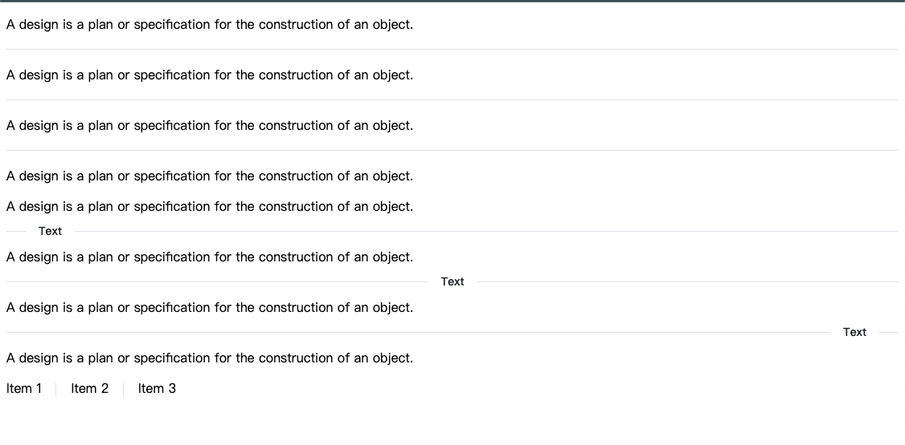
用于分割内容的水平或垂直线条。

**依赖资源:**

- CSS: `/public/sunui/components/divider.css`

**Twig Macro:**

```twig
{# ui.divider(direction, text, textPosition, classes) #}
{{ ui.divider('horizontal') }}
{{ ui.divider('horizontal', '居中文本') }}
```

**HTML 示例:**

```html
<div class="ef-divider ef-divider-horizontal"></div>
<div class="ef-divider ef-divider-vertical"></div>
<div class="ef-divider ef-divider-horizontal ef-divider-with-text-center">
    <span class="ef-divider-inner-text">居中文本</span>
</div>
```

### 1.7 标签 (Label)

提供各种颜色的状态标签。

**依赖资源:**

- CSS: `/public/sunui/components/label.css`

**Twig Macro:**

```twig
{# ui.label(text, type, classes) #}
{{ ui.label('标签', 'primary') }}
{{ ui.label('成功', 'success') }}
{{ ui.label('危险', 'danger') }}
```

### 1.8 提示 (Tip / Tooltip)

带有悬停提示信息的问号图标。需配合 JS 初始化（或依靠框架全局的 tooltip 初始化）。

**依赖资源:**

- CSS: `/public/sunui/components/tip.css`
- JS: `/public/sunui/components/tip.js`

**Twig Macro:**

```twig
{# ui.tip(content, placement) #}
{{ ui.tip('这是一段提示文字', 'top') }}
```

### 1.9 文本高亮/标记笔 (Text Lighting)

用于文本的背景高亮显示，类似荧光笔的标记效果。

**Twig Macro:**

```twig
{# ui.textLighting(text, color, style) #}
{{ ui.textLighting('黄色高亮', 'yellow') }}
{{ ui.textLighting('绿色样式2', 'green', 2) }}
```

**依赖的 CSS:**
需要引入样式文件：`/public/sunui/components/text-lighting.css`。

---

## 2. 选择与表单组件 (Selection & Form)

### 2.1 复选框 (Checkbox)

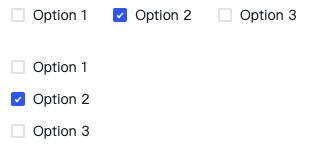
支持自定义选中状态和图标悬停效果。

**依赖资源:**

- CSS: `/public/sunui/components/checkbox.css`
- JS: `/public/sunui/components/checkbox.js`

**Twig Macro:**

```twig
{# ui.checkbox(id, label, value, checked, className) #}
{{ ui.checkbox('chk1', '选项1', '1', true) }}
```

**复选框组:**

```twig
{{ ui.checkbox_group_horizontal([
    {id: 'c1', label: 'A', value: 'a', checked: true},
    {id: 'c2', label: 'B', value: 'b', checked: false}
]) }}
```

### 2.2 单选框 (Radio)

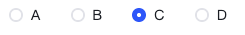
单选框组件，支持同组互斥。

**依赖资源:**

- CSS: `/public/sunui/components/radio.css`
- JS: `/public/sunui/components/radio.js`

**Twig Macro:**

```twig
{# ui.radio(id, name, value, label, checked, attributes) #}
{{ ui.radio('radio1', 'group1', 'A', '选项A', true) }}
{{ ui.radio('radio2', 'group1', 'B', '选项B', false) }}
```

### 2.3 切换按钮 (Switch)

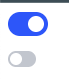
用于两种状态之间的切换。

**依赖资源:**

- CSS: `/public/sunui/components/switch.css`
- JS: `/public/sunui/components/switch.js`

**Twig Macro:**

```twig
{# ui.switch(id, checked, small, attributes) #}
{{ ui.switch('mySwitch', true) }}
{{ ui.switch('mySwitchSmall', false, true) }}
```

### 2.4 选择框 (Select)

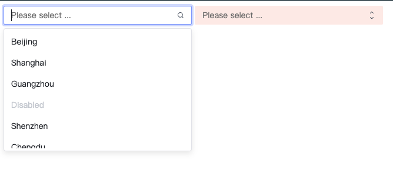
下拉选择框组件。

**依赖资源:**

- CSS: `/public/sunui/components/select.css`
- JS: `/public/sunui/components/select.js`

**Twig Macro:**

```twig
{# ui.select(options, placeholder, width, classes) #}
{{ ui.select([
    { label: '选项1', value: '1' },
    { label: '选项2', value: '2' },
    { label: '禁用选项', value: '3', disabled: true }
], '请选择') }}
```

**HTML 示例:**

```html
<span class="ef-select-view-single ef-select ef-select-view ef-select-view-size-medium ef-select-view-search" style="width: 320px;" chosen="false" id="select1" contentId="content1">
  <input class="ef-select-view-input" placeholder="请选择 ...">
  <span class="ef-select-view-value ef-select-view-value-hidden"></span>
  <span class="ef-select-view-suffix">
    <span class="ef-select-view-icon">
      <svg viewBox="0 0 48 48" fill="none" xmlns="http://www.w3.org/2000/svg" stroke="currentColor" class="ef-icon ef-icon-expand" stroke-width="4" stroke-linecap="butt" stroke-linejoin="miter" style="transform: rotate(-45deg);">
        <path d="M7 26v14c0 .552.444 1 .996 1H22m19-19V8c0-.552-.444-1-.996-1H26"></path>
      </svg>
    </span>
  </span>
</span>
<div class="ef-trigger-popup ef-trigger-position-bl" trigger-placement="bl" style="z-index: 1001; pointer-events: auto; width: 320px; display: none;" id="content1" parentId="select1">
 <div class="ef-trigger-popup-wrapper" style="transform-origin: 0px 0px;">
  <div class="ef-trigger-content">
   <div class="ef-select-dropdown">
                <div class="ef-scrollbar ef-scrollbar-type-embed" style="">
                    <div class="ef-scrollbar-container ef-select-dropdown-list-wrapper">
                        <ul class="ef-select-dropdown-list">
                            <li id="opt1" class="ef-select-option" data-value="1"><span class="ef-select-option-content">选项1</span></li>
                            <li id="opt2" class="ef-select-option" data-value="2"><span class="ef-select-option-content">选项2</span></li>
                        </ul>
                    </div>
                </div>
            </div>
        </div>
    </div>
</div>
```

### 2.5 表单验证初始化 (Form Valid)

用于快速初始化页面中表单的验证逻辑。

**Twig Macro:**

```twig
{{ ui.formValid() }}
```

---

## 3. 布局与反馈组件 (Layout & Feedback)

### 3.1 模态窗口 (Modal)

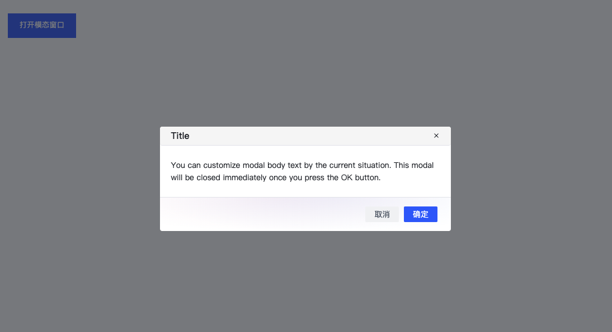
标准模态框组件，带有遮罩层、标题、内容区和底部操作区。默认隐藏或通过 JS 控制显示。

**依赖资源:**

- CSS: `/public/sunui/components/modal.css`
- JS: `/public/sunui/components/modal.js`

**Twig Macro:**

```twig

    <div>模态框的主体内容</div>



    <button class="btn outline medium" type="button" onclick="closeModal('myModalId')">取消</button>
    <button class="btn primary medium" type="button" onclick="confirmModal()">确认</button>


{# ui.modal(id, title, body, footer, options) #}
{{ ui.modal('myModalId', '模态框标题', modalBody, modalFooter, {
    'width': '500px',
    'onClose': 'closeModal(\'myModalId\')'
}) }}
```

**JS 控制显示/隐藏:**

框架在 `/public/sunui/components/modal.js` 中提供了全局方法控制模态框的显示隐藏并附带拖拽功能：

```javascript
// 显示
openModal('myModalId');
// 隐藏
closeModal('myModalId'); // 不传 id 则隐藏所有模态框
```

> **最佳实践**: `ui.modal` 生成了完整的结构。必须使用 `openModal()` 和 `closeModal()` 函数进行控制，这会自动处理 `display` 样式以及头部拖拽初始化。参考示例：`templates/test/modal.html.twig`。

### 3.2 抽屉 (Drawer)

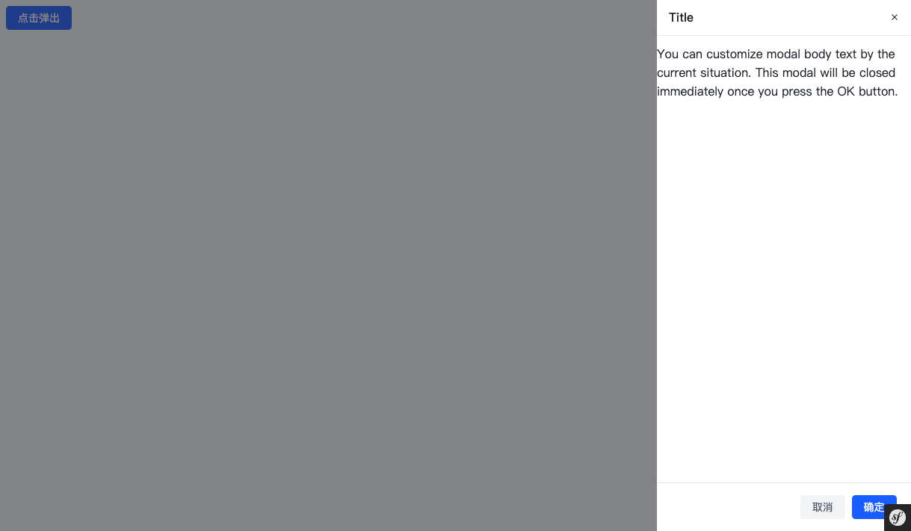
侧边滑出的抽屉组件，常用于展示表单或详情。

**依赖资源:**

- CSS: `/public/sunui/components/drawer.css`
- JS: `/public/sunui/components/drawer.js`

**Twig Macro:**

```twig

    <div>抽屉的主体内容</div>



    <button class="btn outline medium" type="button" onclick="closeDrawer('myDrawerId')">取消</button>
    <button class="btn primary medium" type="button" onclick="saveDrawer()">保存</button>


{# ui.drawer(id, title, body, footer, options) #}
{{ ui.drawer('myDrawerId', '抽屉标题', drawerBody, drawerFooter, {
    'width': '600px',
    'onClose': 'closeDrawer(\'myDrawerId\')'
}) }}
```

**JS 控制显示/隐藏:**

框架提供了 jQuery 扩展方法显示抽屉，或者直接操作样式：

```javascript
// 方式一：jQuery扩展 (drawer.js)
$('.ef-drawer').showDrawer('myDrawerId');

// 方式二：手动控制
const drawer = document.getElementById('myDrawerId');
if (drawer) {
    drawer.style.display = 'block';
    setTimeout(() => { drawer.style.opacity = '1'; }, 10);
}

// 隐藏
const drawer = document.getElementById('myDrawerId');
if (drawer) {
    drawer.style.opacity = '0';
    setTimeout(() => { drawer.style.display = 'none'; }, 200);
}
```

### 3.3 提示 (Alert)

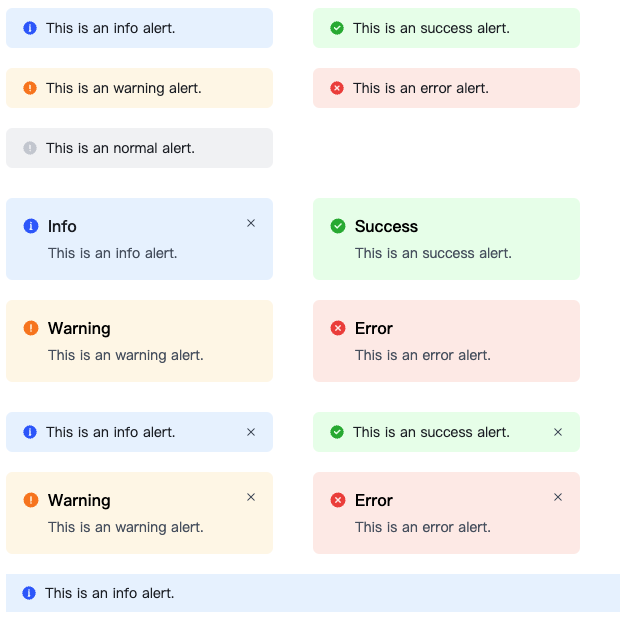
基于框架内部 JS 类 `Alert` 实现的消息提示。

**依赖资源:**

- CSS: `/public/sunui/components/alert.css`
- JS: `/public/sunui/components/alert.js`

**JS 示例:**

```javascript
// 依赖于特定的容器
let alert = new Alert($('#myModalId .modal-body')); // 或者 document.body
alert.error('发生错误', { percent: '90%', title: "错误", closable: true });
alert.success('操作成功', { percent: '90%', title: "成功", closable: true });
```

### 3.4 网格与布局 (Grid & Layout)

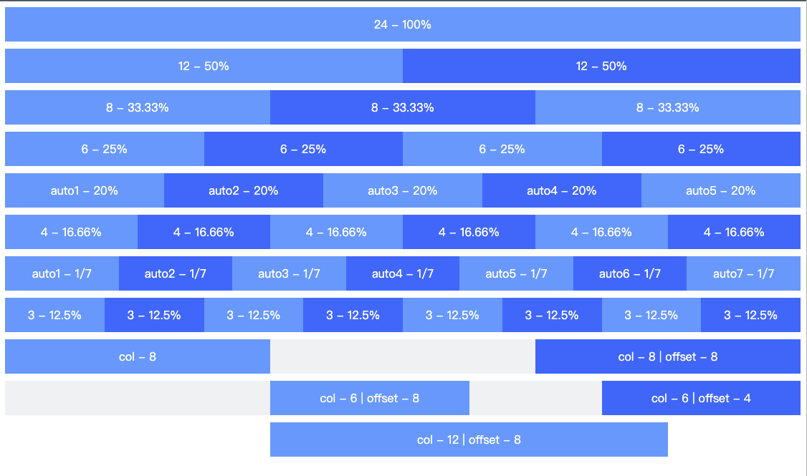
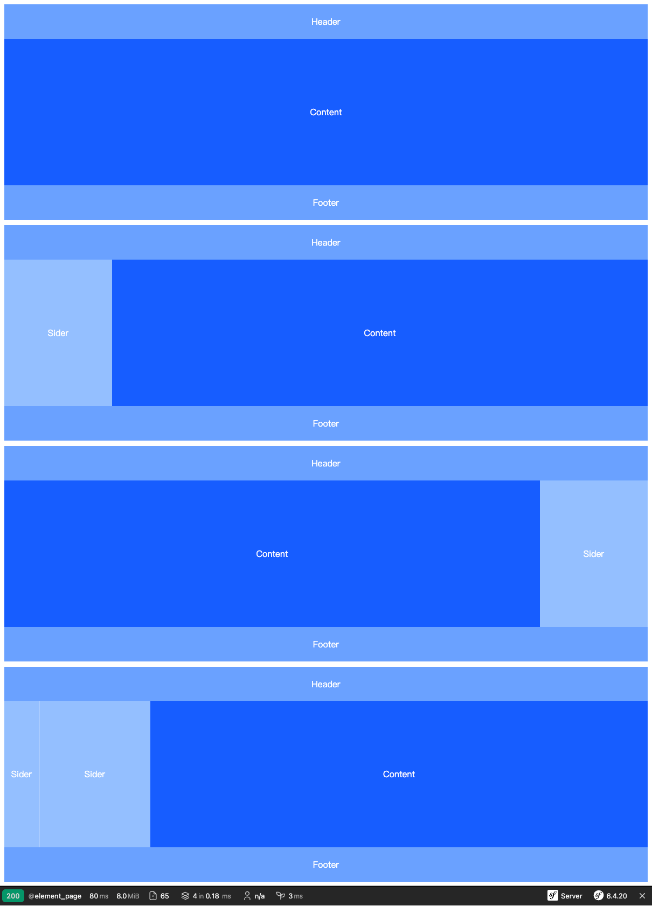
提供标准的行与列布局类，以及页面基础布局结构。

**依赖资源:**

- CSS: `/public/sunui/components/grid.css`
- CSS: `/public/sunui/components/layout.css`

**Grid 示例:**

```html
<div class="ef-row ef-row-align-start ef-row-justify-start">
    <div class="ef-col ef-col-12">一半宽度</div>
    <div class="ef-col ef-col-12">一半宽度</div>
</div>
```

---

## 4. 复杂组件 (Complex Components)

### 4.1 工具栏 (ToolBar)

常用于数据表格（Datagrid）顶部的操作按钮组。

**依赖资源:**

- CSS: `/public/sunui/components/toolbar.css`
- JS: `/public/sunui/components/toolbar.js`

**Twig Macro:**

```twig
{{ ui.toolBar([
    { type: 'create', text: '新增', icon: 'fa-solid fa-plus-circle', id: 'add-button' },
    { type: 'delete', text: '删除', icon: 'fa-solid fa-minus-circle', id: 'delete-button' }
]) }}
```

### 4.2 表单提交区域 (Form Submit Button)

标准的表单底部提交与返回按钮行。

**依赖资源:**

- CSS: `/public/sunui/components/form.css`

**Twig Macro:**

```twig
{{ ui.formSubmitButton() }}
```

### 4.3 标签页 (Tabs)

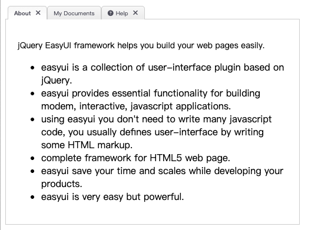
用于内容的分组切换。支持动态添加。

**依赖资源:**

- CSS: `/public/sunui/components/tabs.css`
- JS: `/public/sunui/components/tabs.js`

**HTML 结构与 JS:**

```html
<div id="myTabs" class="ef-tabs tabs-container">
    <div class="tabs-header">
        <ul class="tabs">
            <li class="tabs-selected" id="tab1"><span class="tabs-title">Tab 1</span></li>
            <li id="tab2"><span class="tabs-title">Tab 2</span></li>
        </ul>
    </div>
    <div class="tabs-panels">
        <div class="panel" liid="tab1"><div class="panel-body">内容 1</div></div>
        <div class="panel" liid="tab2" style="display:none;"><div class="panel-body">内容 2</div></div>
    </div>
</div>
```

*(配合 `EfTabs` JS 类进行动态操作)*

```javascript
let myTabs = new EfTabs('myTabs');
// 动态添加Tab
myTabs.addTab('tab3', 'Tab 3', '<div>内容 3</div>');
```

### 4.4 数据表格 (Datagrid) 与 普通表格 (Table)

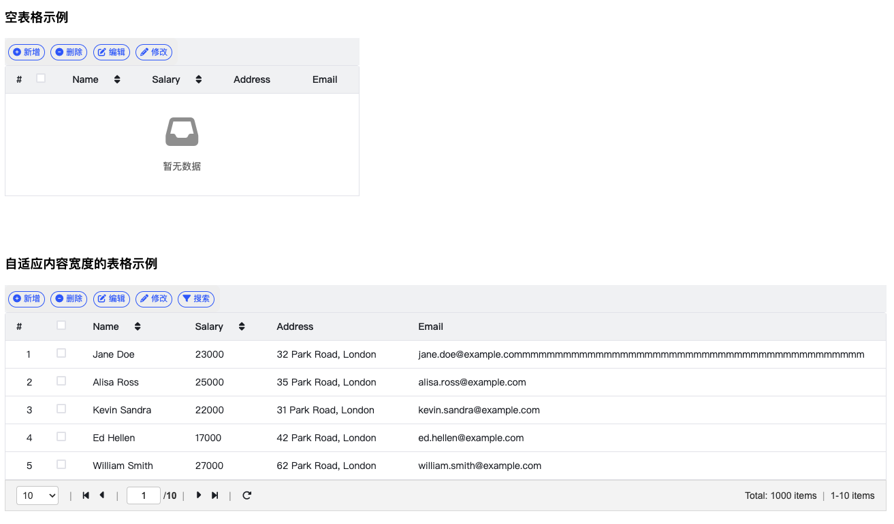
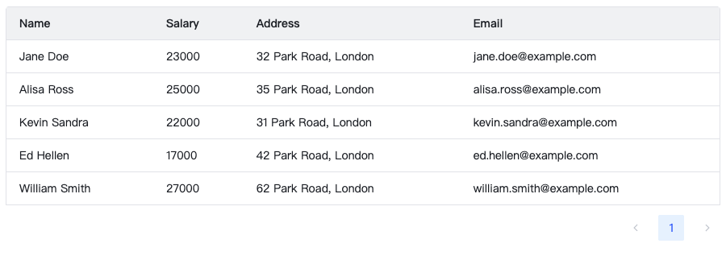
用于展示列表数据，Datagrid 通常附带分页、搜索、多选等复杂功能。

**依赖资源:**

- CSS: `/public/sunui/components/datagrid.css`, `/public/sunui/components/table.css`
- JS: `/public/sunui/components/datagrid.js`

**JS 示例 (Datagrid):**

```javascript
var myGrid = new DataGrid('gridContainer', {
    url: '/api/data',
    method: 'GET',
    columns: [
        { field: 'id', title: 'ID', width: '80px', sortable: true },
        { field: 'name', title: '名称', width: '200px' }
    ],
    pagination: true,
    pageSize: 20
});
myGrid.load();
```

### 4.5 业务选择器 (User & Department)

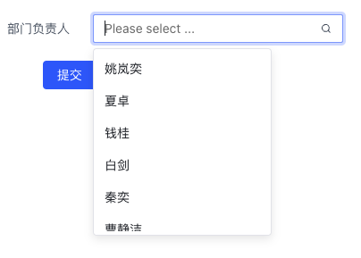
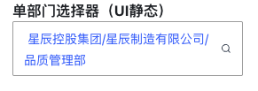
框架内置了用于选择人员和部门的弹窗组件。

**依赖资源:**

- CSS: `/public/sunui/components/user.css`, `/public/sunui/components/department.css`
- JS: `/public/sunui/components/user.js`, `/public/sunui/components/department.js`

### 4.6 模型管理 (Model Management)

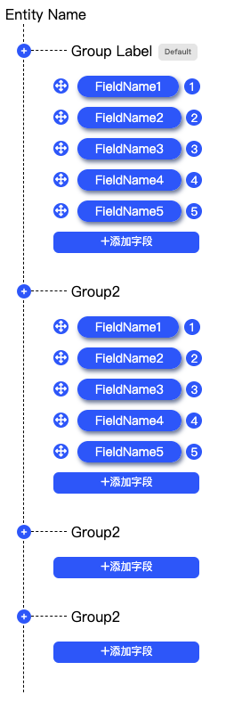
针对动态实体的属性和布局管理界面。

### 4.7 树形控件 (Tree)

用于展示层级关系的数据（如部门结构、菜单树等）。

**依赖资源:**

- CSS: `/public/sunui/components/tree.css`
- JS: `/public/sunui/components/tree.js`

**Twig Macro:**

通过引入 `components/tree.html.twig` 来渲染树形结构。

```twig


<div class="common-tree-wrapper org-structure-container left-tree">
    {{ treeComponent.render_tree(treeData, {
        'isRoot': true,
        'checkbox': false,
        'draggable': false,
        'icon_map': {
            'department': 'fa-solid fa-user-group',
            'company': 'fa-solid fa-building-user'
        }
    }) }}
</div>
```

---
