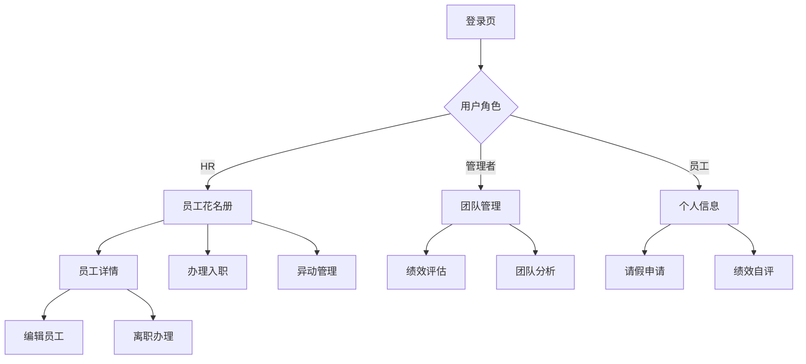

## 1. 产品概述
基于狗狗框架的员工全生命周期管理系统，集成组织架构、人事档案、异动管理等核心功能。为HR、管理者、员工提供差异化视角的人事管理解决方案，提升企业人力资源管理效率。

延续框架的Symfony+Twig技术栈，复用现有UI库和组件，实现快速开发和一致的用户体验。

## 2. 核心功能

### 2.1 用户角色
| 角色 | 注册方式 | 核心权限 |
|------|----------|----------|
| HR管理员 | 系统初始化创建 | 全局员工档案管理、组织架构维护、人事流程审批 |
| 部门经理 | HR授权或自动识别 | 团队人员管理、绩效评估、请假审批 |
| 普通员工 | 入职流程自动创建 | 个人信息维护、请假申请、团队查看、绩效自评 |
| 系统管理员 | 系统初始化创建 | 账号安全、角色权限配置、系统设置 |

### 2.2 功能模块
员工管理系统包含以下核心页面：

1. **员工花名册**：组织架构导航、员工列表、高级搜索、批量操作
2. **员工详情页**：个人信息、职位信息、合同信息、教育经历、工作履历
3. **办理入职**：分步式入职流程、信息采集、账号创建、欢迎邮件
4. **异动管理**：转正、调动、离职、复职流程化管理
5. **团队管理**：我的团队、绩效概览、人员分析、编制管理
6. **人事报表**：人员结构分析、流动率统计、成本分析

### 2.3 页面详情

| 页面名称 | 模块名称 | 功能描述 |
|----------|----------|----------|
| 员工花名册 | 组织架构树 | 展示集团-公司-部门层级结构，支持搜索、展开/收起、点击联动刷新员工列表 |
| 员工花名册 | 搜索筛选区 | 姓名/工号/手机号模糊搜索、状态筛选、入职时间范围、部门多选、导出Excel |
| 员工花名册 | 员工列表 | 工号、姓名、头像、部门、岗位、职级、状态、入职日期、手机、操作按钮 |
| 员工花名册 | 批量操作 | 批量导入、批量调动、批量离职、批量导出、自定义显示列 |
| 员工详情页 | 基本信息 | 头像、工号、姓名、性别、生日、证件、联系方式、地址等个人信息展示 |
| 员工详情页 | 职位信息 | 公司、部门、岗位、职级、汇报对象、员工类型、状态、入职转正离职日期 |
| 员工详情页 | 合同信息 | 合同主体、合同类型、签订日期、到期日期、续签提醒 |
| 员工详情页 | 教育经历 | 学校名称、专业、学历、学位、起止时间、是否全日制 |
| 员工详情页 | 工作履历 | 公司名称、部门、职位、起止时间、工作描述、证明人 |
| 办理入职 | 入职向导 | 分步式流程：基本信息→职位信息→合同信息→教育经历→账号设置→完成 |
| 办理入职 | 信息验证 | 工号唯一性检查、手机号格式验证、身份证合法性校验、邮箱域名验证 |
| 办理入职 | 账号联动 | 选择是否创建系统登录账号，自动生成初始密码，发送欢迎邮件 |
| 异动管理 | 转正申请 | 选择试用期员工，填写转正评价、转正日期、薪资调整，审批流程 |
| 异动管理 | 调动申请 | 选择员工，填写调出调入部门、岗位、职级、调动原因、生效日期 |
| 异动管理 | 离职办理 | 选择员工，填写离职类型、原因、日期、工作交接、禁用账号 |
| 异动管理 | 复职申请 | 选择历史离职员工，恢复原岗位或分配新岗位，重新激活账号 |
| 团队管理 | 团队概览 | 显示我的直属团队、人员编制、实有人数、试用期人数、即将离职人数 |
| 团队管理 | 人员分析 | 年龄分布、学历结构、工龄分析、性别比例、职级分布图表 |
| 团队管理 | 绩效概览 | 团队成员绩效评分、排名、趋势图、待评估提醒 |
| 团队管理 | 编制管理 | 部门编制设置、超缺编分析、招聘需求预测 |
| 人事报表 | 结构分析 | 按部门、职级、年龄、学历、工龄等维度的人员结构分析图表 |
| 人事报表 | 流动分析 | 入职率、离职率、流动率趋势、离职原因分析 |
| 人事报表 | 成本分析 | 人力成本构成、部门成本对比、人均成本趋势 |

## 3. 核心流程

### HR管理流程
HR登录系统→进入员工花名册→选择部门查看员工→点击办理入职→填写入职信息→创建员工档案→发送欢迎邮件→员工报到确认→试用期管理→转正评估→异动处理→离职办理→档案归档

### 员工自助流程
员工登录→查看个人信息→更新联系方式→提交请假申请→查看工资条→参与绩效自评→查看团队公告→离职交接

### 管理者流程
管理者登录→查看我的团队→审批下属申请→进行绩效评估→查看团队分析→人员编制规划→参与招聘决策

## 4. 用户界面设计

### 4.1 设计规范
- **技术栈**：延续框架Symfony+Twig架构，使用Twig模板引擎渲染页面
- **UI组件**：复用/templates/ui/目录中的表格、树形、模态窗口等组件
- **样式规范**：使用框架现有CSS类，遵循Bootstrap-like命名规范
- **图标库**：统一使用FontAwesome免费图标，保持视觉一致性
- **交互方式**：基于jQuery和框架封装的ajax库实现异步交互

### 4.2 页面设计
| 页面名称 | 模块名称 | UI元素 |
|----------|----------|--------|
| 员工花名册 | 组织架构树 | 左侧200px固定宽度，树形结构缩进显示，选中高亮蓝色，悬停灰色背景 |
| 员工花名册 | 搜索区 | 顶部工具栏，输入框圆角4px，搜索按钮蓝色主色，筛选下拉框 |
| 员工花名册 | 数据表格 | 斑马纹行，表头固定，操作列固定右侧，分页底部居中 |
| 员工详情页 | 信息卡片 | 分栏卡片布局，白色背景，阴影效果，标题蓝色边框，内容两列显示 |
| 办理入职 | 步骤条 | 顶部步骤指示器，当前步骤蓝色高亮，完成步骤绿色打勾，未完成灰色 |
| 办理入职 | 表单区 | 标签右对齐，输入框宽度统一，必填项红色星号，错误提示红色文字 |
| 团队管理 | 图表区 | 饼图显示人员结构，柱状图显示年龄分布，折线图显示流动趋势 |
| 人事报表 | 筛选面板 | 顶部时间范围选择器，部门多选下拉，导出按钮右上角 |

### 4.3 响应式设计
- **桌面优先**：优先适配1920×1080、1366×768分辨率
- **平板适配**：768px以上显示完整布局，以下左侧导航收起为汉堡菜单
- **移动端**：手机端仅显示核心功能，表格转为卡片式列表
- **触摸优化**：按钮最小44px点击区域，支持手势滑动切换

## 5. 静态页面方案

基于以上功能设计，提供5个静态页面实现方案：

### 方案A：员工花名册列表页（推荐）
**实现优先级：高**
- 左树右表布局，包含组织架构导航和员工列表
- 搜索筛选功能完整，支持多条件组合查询
- 批量操作按钮齐全，表格展示核心员工信息
- 使用框架现有DataGrid组件，开发成本最低

### 方案B：员工详情展示页
**实现优先级：高**
- 侧滑抽屉形式，分栏展示员工完整信息
- 包含基本信息、职位信息、合同信息、教育经历、工作履历
- 支持编辑入口，操作按钮齐全
- 信息结构清晰，便于快速查看和比对

### 方案C：办理入职向导页
**实现优先级：中**
- 分步式入职流程，顶部步骤条指示进度
- 表单分组清晰，支持保存草稿
- 实时验证和错误提示
- 账号联动创建，自动发送欢迎邮件

### 方案D：团队管理仪表板
**实现优先级：中**
- 管理者视角的团队概览页面
- 人员结构分析图表，数据可视化展示
- 编制管理和超缺编分析
- 绩效概览和待办提醒

### 方案E：异动管理流程页
**实现优先级：低**
- 转正、调动、离职、复职流程化管理
- 表单填写和审批流程
- 历史记录查看和追踪
- 批量处理功能支持

**建议实现顺序**：A → B → C → D → E

**技术实现要点**：
1. 复用框架/templates/ui/目录中的树形组件、表格组件、表单组件
2. 使用FontAwesome图标库，避免自定义图标
3. 遵循框架CSS命名规范，使用现有样式类
4. 基于框架封装的ajax库(/public/lib/ef/base/ajax.js)实现异步交互
5. 使用框架的ApiResponse类处理JSON响应
6. 支持响应式布局，适配不同屏幕尺寸
7. 提供完整的交互逻辑和验证规则