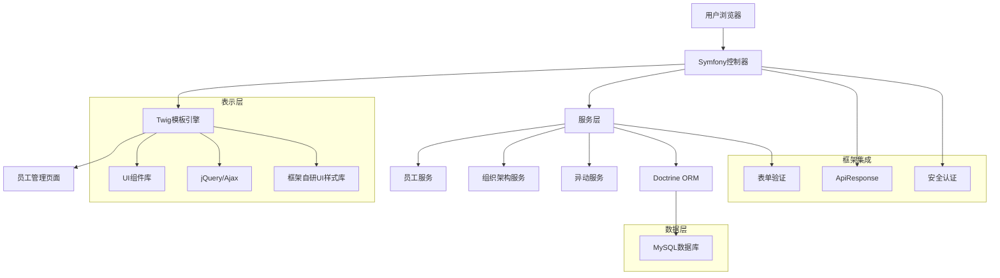

## 1. 架构设计



## 2. 技术描述

* **后端框架**：Symfony\@6 + PHP\@8.1

* **模板引擎**：Twig\@3（Symfony默认集成）

* **前端技术**：jQuery\@3 + 框架自研UI样式库

* **UI组件库**：框架自定义组件（/templates/ui/）

* **HTTP通信**：框架封装的ajax库（/public/lib/ef/base/ajax.js）

* **数据持久化**：Doctrine ORM\@3

* **表单处理**：Symfony Form组件 + 自定义FormType

* **验证框架**：Symfony Validator + 自定义验证规则

* **安全认证**：Symfony Security组件

* **API响应**：框架ApiResponse类（/src/Controller/Api/ApiResponse.php）

* **第三方库**：Font Awesome（免费图标库）

* **页面样式与组件来源**：

  * 栅格与布局：`/public/sunui/ui/grid.css`、`/public/sunui/ui/layout.css`

  * 树组件：`/templates/ui/tree.html.twig`（示例参考 `/templates/test/`）、样式 `public/sunui/components/tree.css`

  * 表格组件：`/templates/ui/table.html.twig`、样式 `public/sunui/components/datagrid.css`

## 3. 路由定义

| 路由路径                   | 控制器方法                             | 模板文件                        | 功能描述         |
| ---------------------- | --------------------------------- | --------------------------- | ------------ |
| /employee              | EmployeeController::index()       | employee/index.html.twig    | 员工花名册主页      |
| /employee/list         | EmployeeController::list()        | employee/list.html.twig     | 员工列表（Ajax请求） |
| /employee/{id}         | EmployeeController::show()        | employee/show\.html.twig    | 员工详情页        |
| /employee/new          | EmployeeController::new()         | employee/new\.html.twig     | 办理入职页面       |
| /employee/{id}/edit    | EmployeeController::edit()        | employee/edit.html.twig     | 编辑员工信息       |
| /employee/transfer     | EmployeeController::transfer()    | employee/transfer.html.twig | 异动管理页面       |
| /api/employee/search   | ApiEmployeeController::search()   | JSON响应                      | 员工搜索API      |
| /api/employee/create   | ApiEmployeeController::create()   | JSON响应                      | 创建员工API      |
| /api/organization/tree | ApiOrganizationController::tree() | JSON响应                      | 组织架构树API     |

## 4. API定义

### 4.1 员工管理API

所有API响应统一使用框架的ApiResponse类格式：

```json
{
  "status": true,
  "message": "操作成功",
  "data": { /* 具体数据 */ },
  "code": 200
}
```

#### 获取员工列表

```
GET /api/employee/search
```

请求参数：

| 参数名                | 类型     | 必填 | 描述               |
| ------------------ | ------ | -- | ---------------- |
| page               | int    | 否  | 页码，默认1           |
| limit              | int    | 否  | 每页条数，默认20        |
| keyword            | string | 否  | 搜索关键词（姓名/工号/手机号） |
| department\_id     | string | 否  | 部门ID筛选           |
| status             | string | 否  | 员工状态筛选           |
| entry\_date\_start | string | 否  | 入职日期开始（Y-m-d）    |
| entry\_date\_end   | string | 否  | 入职日期结束（Y-m-d）    |

#### 创建员工

```
POST /api/employee/create
```

请求体：

```json
{
  "emp_no": "EMP002",
  "name": "李四",
  "gender": "男",
  "mobile": "13900139000",
  "email": "lisi@company.com",
  "department_id": "dept_001",
  "position_id": "pos_002",
  "entry_date": "2024-02-01",
  "create_user": true
}
```

#### 更新员工信息

```
PUT /api/employee/{id}/update
```

#### 删除员工

```
DELETE /api/employee/{id}/delete
```

### 4.2 组织架构API

#### 获取组织架构树

```
GET /api/organization/tree
```

响应格式：

```json
{
  "id": "dept_001",
  "name": "技术部",
  "children": [
    {
      "id": "dept_002",
      "name": "前端组",
      "children": []
    }
  ]
}
```

#### 获取部门成员

```
GET /api/department/{id}/members
```

## 5. 数据模型设计

### 5.1 Symfony实体关系

使用Doctrine ORM定义实体关系：

```php
// src/Entity/Employee.php
namespace App\Entity;

use Doctrine\ORM\Mapping as ORM;
use App\Repository\EmployeeRepository;

#[ORM\Entity(repositoryClass: EmployeeRepository::class)]
#[ORM\Table(name: "employees")]
class Employee
{
    #[ORM\Id]
    #[ORM\GeneratedValue]
    #[ORM\Column(type: 'integer')]
    private $id;

    #[ORM\Column(type: 'string', length: 20, unique: true)]
    private $empNo;

    #[ORM\Column(type: 'string', length: 100)]
    private $name;

    #[ORM\Column(type: 'string', length: 10)]
    private $gender;

    #[ORM\Column(type: 'date', nullable: true)]
    private $birthDate;

    #[ORM\Column(type: 'string', length: 20, unique: true)]
    private $mobile;

    #[ORM\Column(type: 'string', length: 255, unique: true)]
    private $email;

    #[ORM\ManyToOne(targetEntity: Department::class)]
    #[ORM\JoinColumn(name: "department_id", referencedColumnName: "id")]
    private $department;

    #[ORM\ManyToOne(targetEntity: Position::class)]
    #[ORM\JoinColumn(name: "position_id", referencedColumnName: "id")]
    private $position;

    #[ORM\Column(type: 'string', length: 20)]
    private $status = '试用';

    #[ORM\Column(type: 'date')]
    private $entryDate;

    #[ORM\Column(type: 'datetime')]
    private $createdAt;

    #[ORM\Column(type: 'datetime')]
    private $updatedAt;
}
```

### 5.2 数据库表结构（Doctrine迁移）

```php
// migrations/Version20240117000001.php
declare(strict_types=1);

namespace DoctrineMigrations;

use Doctrine\DBAL\Schema\Schema;
use Doctrine\Migrations\AbstractMigration;

final class Version20240117000001 extends AbstractMigration
{
    public function getDescription(): string
    {
        return '创建员工管理相关表结构';
    }

    public function up(Schema $schema): void
    {
        // 员工表
        $this->addSql('CREATE TABLE employees (
            id INT AUTO_INCREMENT NOT NULL,
            emp_no VARCHAR(20) NOT NULL,
            name VARCHAR(100) NOT NULL,
            gender VARCHAR(10) DEFAULT NULL,
            birth_date DATE DEFAULT NULL,
            mobile VARCHAR(20) DEFAULT NULL,
            email VARCHAR(255) DEFAULT NULL,
            avatar VARCHAR(255) DEFAULT NULL,
            status VARCHAR(20) DEFAULT \'试用\',
            employee_type VARCHAR(20) DEFAULT \'全职\',
            entry_date DATE NOT NULL,
            regular_date DATE DEFAULT NULL,
            resignation_date DATE DEFAULT NULL,
            department_id INT DEFAULT NULL,
            position_id INT DEFAULT NULL,
            company_id INT DEFAULT NULL,
            user_id INT DEFAULT NULL,
            created_at DATETIME NOT NULL,
            updated_at DATETIME NOT NULL,
            UNIQUE INDEX UNIQ_EMP_NO (emp_no),
            UNIQUE INDEX UNIQ_MOBILE (mobile),
            UNIQUE INDEX UNIQ_EMAIL (email),
            INDEX IDX_DEPARTMENT (department_id),
            INDEX IDX_STATUS (status),
            INDEX IDX_ENTRY_DATE (entry_date),
            PRIMARY KEY(id)
        ) DEFAULT CHARACTER SET utf8mb4 COLLATE `utf8mb4_unicode_ci` ENGINE = InnoDB');

        // 部门表
        $this->addSql('CREATE TABLE departments (
            id INT AUTO_INCREMENT NOT NULL,
            name VARCHAR(100) NOT NULL,
            code VARCHAR(50) DEFAULT NULL,
            parent_id INT DEFAULT NULL,
            company_id INT DEFAULT NULL,
            sort_order INT DEFAULT 0,
            is_active TINYINT(1) DEFAULT 1,
            created_at DATETIME NOT NULL,
            updated_at DATETIME NOT NULL,
            INDEX IDX_PARENT (parent_id),
            INDEX IDX_COMPANY (company_id),
            PRIMARY KEY(id)
        ) DEFAULT CHARACTER SET utf8mb4 COLLATE `utf8mb4_unicode_ci` ENGINE = InnoDB');
    }

    public function down(Schema $schema): void
    {
        $this->addSql('DROP TABLE employees');
        $this->addSql('DROP TABLE departments');
    }
}
```

#### 现有组织模型引用（无需新建SQL表）

* `App\Entity\Organization\Company`（表：`org_company`）路径：`src/Entity/Organization/Company.php`

* `App\Entity\Organization\Department`（表：`org_department`，NestedSet树形）路径：`src/Entity/Organization/Department.php`

* `App\Entity\Organization\Position`（表：`org_position`，含部门、级别关联）路径：`src/Entity/Organization/Position.php`

* `App\Entity\Organization\PositionLevel`（岗位级别）路径：`src/Entity/Organization/PositionLevel.php`

* `App\Entity\Organization\Employee`（员工实体）路径：`src/Entity/Organization/Employee.php`

以上实体已由框架通过 Doctrine ORM 管理，字段与关系映射完整，直接复用即可；文档不再提供 SQL 建表示例。

### 5.3 Symfony安全配置

```yaml
# config/packages/security.yaml
security:
    providers:
        app_user_provider:
            entity:
                class: App\Entity\User
                property: username

    firewalls:
        dev:
            pattern: ^/(_(profiler|wdt)|css|images|js)/
            security: false

        api:
            pattern: ^/api/
            stateless: true
            json_login:
                check_path: /api/login
                username_path: username
                password_path: password

        main:
            lazy: true
            provider: app_user_provider
            form_login:
                login_path: app_login
                check_path: app_login
            logout:
                path: app_logout

    access_control:
        - { path: ^/admin, roles: ROLE_ADMIN }
        - { path: ^/employee, roles: ROLE_USER }
        - { path: ^/api/employee, roles: ROLE_USER }
```

## 6. 前端组件架构

### 6.1 Twig模板结构

```
templates/
├── employee/
│   ├── index.html.twig      # 员工花名册主页
│   ├── list.html.twig      # 员工列表片段
│   ├── show.html.twig      # 员工详情页
│   ├── new.html.twig       # 办理入职页
│   ├── edit.html.twig      # 编辑员工页
│   └── transfer.html.twig  # 异动管理页
├── components/
│   ├── employee_card.html.twig     # 员工信息卡片
│   ├── organization_tree.html.twig # 组织架构树
│   ├── employee_table.html.twig    # 员工表格
│   └── search_form.html.twig       # 搜索表单
└── base.html.twig          # 基础模板
```

### 6.2 组件复用策略

1. **复用框架现有组件**：

   * 使用 `/templates/ui/` 目录下的表格组件（data-table）

   * 使用 `/templates/ui/` 目录下的树形组件（tree）

   * 使用 `/templates/ui/` 目录下的模态窗口组件（modal）

   * 参考 `/templates/test/` 目录下的示例实现

2. **自定义Twig组件**：

   * 员工信息卡片（employee\_card.html.twig）

   * 组织架构树（organization\_tree.html.twig）

   * 搜索表单（search\_form.html.twig）

   * 分页组件（pagination.html.twig）

3. **JavaScript组件集成**：

   * 使用框架封装的ajax库进行异步请求

   * 基于jQuery实现交互逻辑

   * 使用DataTables增强表格功能

   * 使用Select2实现下拉选择器

## 7. 性能优化方案

### 7.1 前端优化

* **表格分页**：使用DataTables内置分页功能

* **异步加载**：基于框架ajax库实现无刷新交互

* **缓存策略**：浏览器端数据缓存，减少重复请求

* **选择器优化**：使用Select2实现大数据量下拉选择

### 7.2 后端优化

* **数据库索引**：关键字段建立索引（工号、手机号、邮箱等）

* **分页查询**：所有列表接口支持分页，避免全表扫描

* **关联查询优化**：使用Doctrine关联查询减少N+1问题

* **查询缓存**：启用Doctrine查询结果缓存

### 7.3 框架优化

* **模板缓存**：启用Twig模板编译缓存

* **自动加载优化**：使用Composer优化自动加载

* **服务容器**：合理使用Symfony服务容器

* **事件监听器**：使用Symfony事件系统解耦业务逻辑

